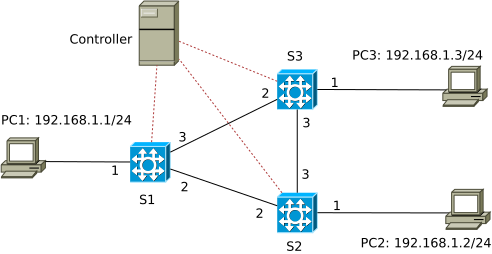

# Implementing ARPcache

The network topology used in this example contains a loop S1-S2-S3-S1:



We should to be familiar with the [simple\_demo](../simple_demo) and [simple\_switch](../simple_switch) examples before diving in this ARPcache.

The normal learning switch in [simple\_switch](../simple_switch) broadcasts a packet on all ports (except for the incoming port) if it has not learnt the MAC address of that packet. In a network topology containing loops like the one shown in the above picture, such behaviour would amplify new packets in many rounds, which could cause the network to be overloaded and unresponsive. 

In SDN, we can exploit the knowledge of the controller about the network topology to overcome the amplifying of packets in a network containing loops (normally, the controller has a built-in function of detecting the connections between switches (and even connections to hosts), namely topology discovery (see an explanation by Volkan here https://volkan.yazi.ci/blog/post/2013/08/06/sdn-discovery/); in our examples, we haven't implemented that function but simulated it via the encoding of the topology in a json file (topo\_loop.json)). 

The operating mechanism of ARPcache is simple. We set the default behaviour of P4-switches to be: sending unknown packets (those that the switches don't know how to handle due to the absence of rules in their tables) to the controller via the packet-in mechanism (packets sent from SDN devices to the controller) and do not flood them on other ports as in the simple\_switch example. Based on the knowledge of the network topology, the controller can determine the switches in the network and which ports of each switch are connected to end-points (and also which ports are connected to other switches). As the final goal of the broadcasting action in the simple\_switch is to send the original packet to other end-points, now in this case, the controller can simply use the packet-out mechanism (packets sent by the controller to SDN-devices) to replicate the packet received from a P4-switch to all end-points in the network (we name this "shortcut flooding", as opposed to the normal flooding of simple\_switch). Basically, the process is:
+ the end-point sends a packet into the network,
+ the switch, directly connected to that end-point, does not know how to handle that packet, it sends that packet to the controller (via the packet-in mechanism),
+ the controller sends the packets to all other end-points via the packet-out mechanism, using its knowledge of the network topology. At the same time, the controller "caches" the information: that end-point is directly connected to that switch via that port in the format: end-point's IP, end-point's MAC, switch ID, port number.
+ All end-points receive that packet. Only the "pertinent" end-point sends answers to the original sender (and the other end-points should drop that packet). The switch directly connected to the answering end-point asks the controller what to do via the packet-in mechanism, the controller knows the address of the recipient that it cached in the previous step, so it calculates a path between the sender and the receivers based on the topology information and installs forwarding rules in all switches along that path. Now, the communication between the sender and the receiver can be carried out as usual. In this step, the controller also caches the information of the other end-point in the same format as before: end-point's IP, end-point's MAC, switch ID, port number. Gradually, the controller caches all end-points' information and can install corresponding rules once being asked by an SDN-switches.

## Considering a concrete replay

Consider a concrete case in the network topology above.
+ PC1 wants to talk with PC3 (e.g., via the ping command: ping 192.168.1.3), firstly it sends an ARP Request message asking for the MAC address of PC3. This ARP message contains the IP and MAC addresses of PC1.
+ This ARP message reaches switch S1, there's no rule in S1 to handle it. S1 sends this ARP message to the controller via the packet-in mechanism, it also tells that the ingress port of this ARP message is port 1.
+ The controller receives this message from switch S1,
  + the controller parses the content of the message and caches the information: the IP 192.168.1.1 is associated with the MAC address of PC1, say MAC\_PC1, and is reachable via port 1 of switch S1,
  + the controller checks its ARPcache database for information of the destination in the ARP Request message, being 192.168.1.3, and finds no record; hence, it broadcasts the ARP message to all end-points: based on its knowledge of the network topology, it knows that port 1 of each of switches S1, S2 and S3 is connected to end-points, the controller replicates the ARP message and sends them on port 1 of switch S2 and S3 using the packet-out mechanism. As this ARP message originates from port 1 of switch S1, the controller does not send it there.
+ Switches S2 and S3 receive the packet-out messages from the controller and forward them as instructed by the controller. These messages reach PC2 and PC3. PC2 drops it, PC3 answers by an ARP Reply containing PC3's IP and MAC addresses, and PC1's IP and MAC addresses.
+ The ARP Reply of PC3 reaches switch S3, S3 does not know how to handle and asks the controller for instruction via the packet-in mechanism, which also tells the ingress port of this ARP Reply being port 1.
+ The controller receives the ARP Reply from switch S3,
  + it parses the content of the ARP Reply message and caches the information: the IP 192.168.1.3 is associated with the MAC address of PC3, say MAC\_PC3, and is reachable via port 1 of switch S3,
  + the controller checks its ARPcache database for information of the destination in the ARP Reply message, being 192.168.1.1, and finds an existing record, that this IP can be reached via port 1 of switch S1. It calculates the path from the asking switch, being S3, to switch S1, installs corresponding rules in all switches along this path in both directions (from PC1 to PC3, and from PC3 to PC1), and sends the ARP Reply out of port 1 of switch S1 via the packet-out mechanism.
+ Now there are rules in switches S1 and S3 to handle traffic between PC1 and PC3, these PCs can communicate with each other. The controller has also cached the relevant information of PC1 and PC3 in its ARPcache database. A similar process takes place for other traffic as well, e.g., the traffic between PC2 and PC3.

## Implementation

To enable the packet-in and packet-out mechanisms in a P4-device, we need to declare the following instructions in the P4 program:
```
@controller_header("packet_in")
header packet_in_header_t {
    bit<9>  ingress_port;
    bit<7>      _pad;
}

@controller_header("packet_out")
header packet_out_header_t {
    bit<9> egress_port; // egress_port is 9-bit wide
    //bit<16> egress_port;
    bit<7>      _pad; //padding
}
```
and specify them as parts of the general packet header:
```
struct headers {
    packet_out_header_t packet_out;
    packet_in_header_t packet_in;
    @name(".ethernet")
    ethernet_t   ethernet;
    ...
}
```
To send a packet from a P4-device to the controller, we need to specify the CPU port (short for Control Plane Unit port, I guess) and employ the corresponding action:
```
#define CPU_PORT 255

...

action send_to_cpu() {
    standard_metadata.egress_spec = CPU_PORT;
}
```
Importantly, when starting the P4-device, the same CPU port must be given, e.g.,:
```
sudo simple_switch_grpc -i 1@eth1 -i 2@eth2 -i 3@eth3 --pcap pcaps --nanolog ipc:///tmp/s1-log.ipc --device-id 1 build/packetout.json --log-console --thrift-port 9090 -- --grpc-server-addr 0.0.0.0:50051 --cpu-port 255
```

The controller (file `arpcache.py`) continuously listens for packet-in events and processes them via the function `process_packet_in`. It parses packet-in messages (mainly ARP messages) by the function `update_arpdb` (update ARP database) and broadcasts ARP Request to end-points via the `broadcast_arp_request_to_endpoints` function, which invokes the `send_packet_out` function. If the controller has all necessary information in its ARPcache database to answer "questions" from P4-switches regarding forwarding decision, it will install forwarding rules in these switches using the `install_path_rule_for_arp_reply` function.

## Execution

Compiling the P4 code:
```
p4c-bm2-ss --p4v 16 --p4runtime-files build/packetinout.p4info.txt -o build/packetinout.json packetinout.p4
```

Making switches S1, S2, S3 become P4-switches, the command below applies for switch S1 (see [simple\_demo](../simple_demo) for detailed description of the options): 
```
sudo simple_switch_grpc -i 1@eth1 -i 2@eth2 -i 3@eth3 --pcap pcaps --nanolog ipc:///tmp/s1-log.ipc --device-id 1 build/packetinout.json --log-console --thrift-port 9090 -- --grpc-server-addr 0.0.0.0:50051 --cpu-port 255
```
It is important to specify the CPU-port to be the same port declared in the P4 code (file `packetinout.p4`), being 255 in this case.

Executing the controller program:
```
python arpcache.py
```

Generating traffic between end-points, e.g., using netcat:

PC1: `nc -lk 12345 -vn`

PC2: `nc 192.168.1.1 12345 -vn`
