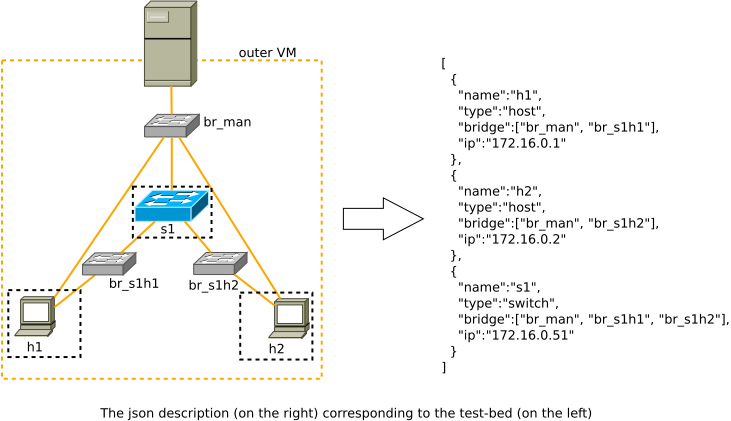

# Create a Testbed for P4-based SDN using KVM and openvswitch (instead of using Xen and Linux Bridge):

In another repository (https://github.com/mnm-team/sdn-conflicts/tree/main/topogen), we show how to create SDN infrastructure (OpenFlow-based SDN) using Xen. In this repo, we show an alternative to create a test-bed for P4-based SDN. In general, the script can be adapted to create test-beds for network testing, since the test-bed is built on virtual machines (VM), with appropriate software installed, a VM can be a switch (e.g., using Open vSwitch), a router (e.g., with FRRouting)...

## Goal:

Create a big outer VM, in which a network of KVM-based VMs constituting the test-bed is constructed, these internal KVM-based VMs can be hosts, switches, controllers, security servers.

The test-bed is "packed" in a big VM, so that its network is isolated from the outside network, and also isolated from other test-beds in the same physical machine. Therefore, our testing will not influence the other networks and vice versa.

## 1. Create outer VM 

The steps are described in the directory 1\_setup\_outer\_VM.
In essence, we assume the existence of the outer VM (or outer machine), then we need to run the script 1\_create\_user\_res.bash and 2\_install\_basic\_software.bash. The outer VM can be created using the provided way described in the script 0\_create\_outervm.bash

The main user of both the outer and inner machines is *res*.

After installing the basic software with the script: 2\_install\_basic\_software.bash, log out and log in again to update the environment variables and the user group (user res belongs to group libvirt)

## 2. Create test-bed (directory 2\_create\_testbed)

File: create\_testbed.bash

The topology for test-bed is specify by the variable TOPO\_JS (topology in json format), which is passed by variable $1 when executing this script.

The test-bed is created using template image base-fresh.qcow2 for all VMs, which can be downloaded at: https://syncandshare.lrz.de/getlink/fig44bCmzi6p9PeaazCRC/base-fresh.qcow2.
However, we can also differentiate between different types of VM, e.g., host, switch, server, controller; in that case, we can customize the base-fresh.qcow2 to make it become template-images for these types of VM. Adapt the variable BASE\_HOST and BASE\_SW in the script for the correct base images.

The template image is created based on the debian11 image: https://cdimage.debian.org/debian-cd/current/amd64/iso-cd/debian-11.6.0-amd64-netinst.iso. We use debian11 for software compatibility in deploying P4 switches and the SDN controller. We can create a template image in a similar way as described in the file 1\_setup\_outer\_VM/0\_create\_outervm.bash. For our project (P4-based SDN project), we need to modify the template image to use the old simple scheme for network interface name (eth0, eth1...) instead of the new "persistent names" schem (network interfaces are named as en0, en1, en0p1,....), as it is easier for parsing and for scripting in a program. The network interface naming is described in https://wiki.debian.org/NetworkInterfaceNames.

If we want to recreate a fresh test-bed, we need to first destroy it using the script destroy\_testbed.bash, then run the script create\_testbed.bash as just described above.

Once the test-bed is created, we can access to the outer VM, therefrom we can access to each VM using its name or its IP address specified in the json file (this json file is the input to the script create\_testbed.bash), e.g., `ssh h1` to access to the host h1.

## 3. Installing P4 switches and SDN controller (optionally, specific to the P4-based SDN project)

Follow the instruction in 2\_create\_testbed/installing\_controller\_and\_p4\_switches.bash to install the p4 switches and controller on the corresponding VMs in the test-bed. The instruction is based on https://github.com/p4lang/tutorials/tree/master/vm-ubuntu-20.04

## 4. Explaining the implementation of VM-based test-bed

