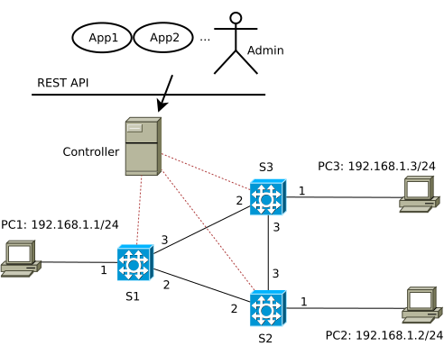

# Intent-based Networking

The network topology used in this example:



The previous examples: [simple\_demo](../simple_demo), [simple\_switch](../simple_switch) and [ARPcache](../ARPcache) should be made familiar in order to understand this one.

Software-defined Networking (SDN) facilitates the policy-based network management (PBNM) approach thanks to the centralized control of the network by the controller. Policies can be defined, translated, refined, optimized..., then the controller can help enforce them in network devices in an easy way. This is much harder to accomplish in traditional networks with distributed control plane in each network device (see a comparison between SDN and traditional networks in [explaining SDN](../explaining_SDN)). The capability of programming networks in SDN creates a big difference to traditional networks which support mainly manual network configuration.

In this example, we demonstrate the capability of leveraging SDN for PBNM by implementing two APIs: allow and deny, which allow and deny the communication between two given end-points, respectively. As shown in the picture, an application or an administrator can invoke these APIs to enable or disable the communication, without having to configure each network device manually. In the same manner, further APIs can be realized for a richer set of policies, e.g., allowing stateful connection, rate-limiting, deploying temporary policies (with idle timeout), restricting certain traffic in one direction.

The ambition "Intent-based Networking" (IBN) is still far to achieve. However, without a big dream, we are less motivated to go far. Refer to [RFC9315](https://www.rfc-editor.org/rfc/rfc9315.html), [RFC9316](https://www.rfc-editor.org/rfc/rfc9316) and [RFC9417](https://www.rfc-editor.org/rfc/rfc9417) for more information on IBN. Obviously, SDN can contribute efficiently to this long-term goal.


## Implementation
As usual, the implementation covers P4 source code (data plane) and the controller (control plane).

### P4 switch
Compared to the previous examples, the IBN P4-switch can mirror traffic by the table `tab_mirror`, match traffic with more granular match fields: `(ingress_port, source IPv4 address, destination IPv4 address, IP protocol, layer 4 source port, layer4 destination port)` by the table `tab_ibn`. The table `tab_ibn` also supports idle timeout.

```
    action mirror() {
        clone(CloneType.I2E, 100);    // We'll be using session 100.
    }

    ...

    table tab_mirror {
        key = {
            standard_metadata.ingress_port: exact;
        }
        actions = {
            mirror();
            NoAction;
        }
        size = 256;
        default_action = NoAction;
    }

    ...

    table tab_ibn {
        key = {
            standard_metadata.ingress_port: range;
            hdr.ipv4.srcAddr: ternary;
            hdr.ipv4.dstAddr: ternary;
            hdr.ipv4.protocol: range;
            meta.meta.l4_sp: range;
            meta.meta.l4_dp: range;
        }
        actions = {
            drop;
            NoAction;
            send_to_cpu;
            forward;
        }
        support_timeout = true;
        size = 1024;
        default_action = send_to_cpu;
    }
```
By default, ARP traffic is processed by the `smac` and `dmac` rule tables. IP traffic is regulated by the `tab_ibn` table.
```
    apply {
        if (hdr.packet_out.isValid()) {
            standard_metadata.egress_spec = hdr.packet_out.egress_port;
            hdr.packet_out.setInvalid();
            exit;
        }
        if ( hdr.arp.isValid()){
            if( smac.apply().hit) {
                dmac.apply();
                tab_mirror.apply(); //mirror only traffic sent out of this switch
            }
        } else if ( tab_ibn.apply().hit ) {
            tab_mirror.apply(); //mirror only traffic sent out of this switch
        }
    }

```


### Controller

We use python [Flask](https://flask.palletsprojects.com/) to implement the REST APIs.

File `ibn_api.py`
```
from flask import Flask, jsonify, request
from flask_restful import Api

...

app = Flask(__name__)
api = Api(app)

...

@app.route('/allow', methods=['POST'])
def add_ibn_rulepath():

...

@app.route('/deny', methods=['POST'])
def del_ibn_rulepath():

...

```

The above APIs invoke the functions `install_path_rule_in_ibn_table` and `delete_path_rule_in_ibn_table` in the file `ibn_app.py`. The logic of `ibn_app.py` is mostly explained in the [ARPcache](../ARPcache) example.


## Execution

Compiling the P4 code:
```
p4c-bm2-ss --p4v 16 --p4runtime-files build/ibn_sw.p4info.txt -o build/ibn_sw.json ibn_sw.p4
```

Making switches S1, S2, S3 become P4-switches, the command below applies for switch S1 (see [simple\_demo](../simple_demo) for detailed description of the options): 
```
sudo simple_switch_grpc -i 1@eth1 -i 2@eth2 -i 3@eth3 --pcap pcaps --nanolog ipc:///tmp/s1-log.ipc --device-id 1 build/ibn_sw.json --log-console --thrift-port 9090 -- --grpc-server-addr 0.0.0.0:50051 --cpu-port 255
```
It is important to specify the CPU-port to be the same port declared in the P4 code (file `ibn_sw.p4`), being 255 in this case.

Executing the controller program:
```
python ibn_api.py
```

Generating traffic between end-points, e.g., using `ping` or `netcat`:

PC1: `ping 192.168.1.2`

Originally, IP traffic is not allowed from PC1 to PC2, so `ping` is not yet successful.

We can use the `curl` command to invoke the `allow` API of the controller to allow IP traffic between PC1 and PC2 as follows (supposed that the controller is listening at 192.168.0.22:8080):

```
curl -X POST -d '{"src_ipv4_addr":"192.168.1.1", "dst_ipv4_addr":"192.168.1.2"}' http://192.168.0.22:8080/allow
```
Now the `ping` should be successful.

Likewise, we can deny the communication between PC1 and PC2 using the `deny` API:
```
curl -X POST -d '{"src_ipv4_addr":"192.168.1.1", "dst_ipv4_addr":"192.168.1.2"}' http://192.168.0.22:8080/deny
```
`ping` reports no success again.

We can specify all values in the `curl` command for `(src_ipv4_addr, dst_ipv4_addr, ip_proto, src_port, dst_port)` as the following:
```
curl -X POST -d '{"src_ipv4_addr":"192.168.1.1", "dst_ipv4_addr":"192.168.1.2", "ip_proto":6, "src_port":2000, "dst_port":5000}' http://192.168.0.22:8080/allow

curl -X POST -d '{"src_ipv4_addr":"192.168.1.1", "dst_ipv4_addr":"192.168.1.2", "ip_proto":6, "src_port":2000, "dst_port":5000}' http://192.168.0.22:8080/deny
```

Another example with `netcat`:
```
curl -X POST -d '{"src_ipv4_addr":"192.168.1.1", "dst_ipv4_addr":"192.168.1.2", "ip_proto":6, "dst_port":5000}' http://192.168.0.22:8080/allow
```
PC2: `nc -lk 5000 -vn`

PC1: `nc 192.168.1.2 5000 -vn`

--> success.

then 
```
curl -X POST -d '{"src_ipv4_addr":"192.168.1.1", "dst_ipv4_addr":"192.168.1.2", "ip_proto":6, "dst_port":5000}' http://192.168.0.22:8080/deny
```
--> The existing `nc` between PC1 and PC2 is terminated.

## Conclusion

We demonstrated the two simple APIs `allow` and `deny`, as a proof-of-concept for employing P4-based SDN for the policy-based network management approach. In the same manner, further APIs can be implemented. Refinement, translation techniques for different level of policies (see the below picture from Vitalian Danciu, also in the book [Conflict detection in software-defined networks](https://edoc.ub.uni-muenchen.de/30344/)) in the upper plane (above the controller) can then help the ambition of Intent-based Networking come true.


