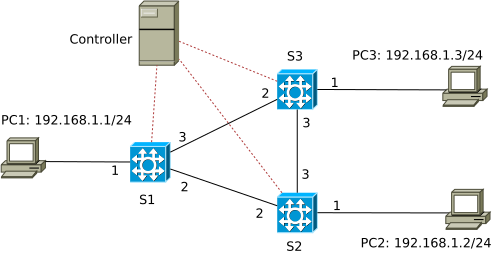

# Counters

The network topology used in this example:



We expand the [ARPcache](../ARPcache) example with counters to retrieve statistic data of P4-switches.

The previous examples: [simple\_demo](../simple_demo), [simple\_switch](../simple_switch) and [ARPcache](../ARPcache) should be made familiar in order to understand this one.

Two types of counters are specified in P4 devices according to the standard, including direct counter and indexed counter (also indirect counter). Details are described in this link: https://staging.p4.org/p4-spec/p4runtime/v1.3.0/P4Runtime-Spec.html#sec-counter-directcounter

A direct counter is attached to a specific rule table and collects statistic data, e.g., byte count and packet count, i.e., the number of bytes and packets matched by each rule in that table. The direct counter has as many cells as the number of entries in the table. In other words, it is an array, its size adapts to the number of rules in the rule table that it attaches to.

An indexed counter provides a fixed number of independent counter values, also called cells. Each cell can be read by the control plane using an integer index. It can count, e.g., bytes or packets of a specific port of a switch, or collect statistic data bound to a rule table (the whole table, not for each entry as a direct counter), and so on.

## Implementation

### Direct counter

To attach a direct counter to a rule table, we need to declare it first:
```
    direct_counter(CounterType.packets_and_bytes) rule_counter;
```
Its type indicates that it can count packets and bytes. We make it a part of the table as follows:
```
    table dmac {
        key = {
            hdr.ethernet.dstAddr: exact;
        }
        actions = {
            forward;
            send_to_cpu;
            NoAction;
        }
        size = 256;
        counters = rule_counter;
        default_action = send_to_cpu;
    }
```

In the controller, the function `direct_counter_read` is invoked to retrieve the result:
```
res = self.con[swid].controller.direct_counter_read('rule_counter', normal_match, priority)
```
The result `res` contains a tuple `(byte_count, packet_count)`.

### Indexed counter

Likewise, we can declare an indexed counter and use it for some purpose, e.g., to count the number of bytes and packets coming to a port of a switch:
```
    counter(512, CounterType.packets_and_bytes) port_counter;

    ...

    apply {
        port_counter.count((bit<32>) standard_metadata.ingress_port);
        if (hdr.packet_out.isValid()) {
            standard_metadata.egress_spec = hdr.packet_out.egress_port;
            hdr.packet_out.setInvalid();
            exit;
        }
        if (smac.apply().hit){
            dmac.apply();
        }
    }
```

To get its current value, the function `counter_read` is invoked at the controller:
```
counter_value = self.con[1].controller.counter_read('port_counter',i)
```

Explanation of counters is also provided as comments at:
https://github.com/p4lang/p4c/blob/main/p4include/v1model.p4

The APIs `direct_counter_read` and `counter_read` are described at: https://nsg-ethz.github.io/p4-utils/p4utils.utils.sswitch\_p4runtime\_API.html

Certainly, the two types of counters can be used in a switch.

## Execution

Compiling the P4 code, e.g., for the direct counter variant:
```
p4c-bm2-ss --p4v 16 --p4runtime-files build/packetinout_directcounter.p4info.txt -o build/packetinout_directcounter.json packetinout_directcounter.p4
```

Making switches S1, S2, S3 become P4-switches, the command below applies for switch S1 (see [simple\_demo](../simple_demo) for detailed description of the options): 
```
sudo simple_switch_grpc -i 1@eth1 -i 2@eth2 -i 3@eth3 --pcap pcaps --nanolog ipc:///tmp/s1-log.ipc --device-id 1 build/packetinout_directcounter.json --log-console --thrift-port 9090 -- --grpc-server-addr 0.0.0.0:50051 --cpu-port 255
```
It is important to specify the CPU-port to be the same port declared in the P4 code (file `packetinout_directcounter.p4`), being 255 in this case.

Executing the controller program:
```
python direct_counter_controller.py
```

Generating traffic between end-points, e.g., using ping or netcat:

PC1: `nc -lk 12345 -vn`

PC2: `nc 192.168.1.1 12345 -vn`
