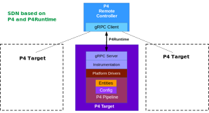

In traditional networks, the control plane and data plane are tightly bundled in each network device. For example, the OSPF routing protocol (control plane) populates the routing table (residing in the data plane) in a router; each router has its own OSPF instance, these instances communicate with each other (via the connections between these routers in the data plane) to have the global information of the network domain that they influence. 
This networking approach of distributed control plane facilitates the fast growth of a network (and the big Internet), however, it also largely  hinders network innovation. The control plane can only be defined, programmed, changed by network vendors. End-users can only enable, disable or configure some existing features on network devices, but cannot add or program a new function by themselves. The process of requesting a new feature by end-users to network vendors often takes months or years (see [SDN: the new norm for networks](https://opennetworking.org/wp-content/uploads/2011/09/wp-sdn-newnorm.pdf))

The approach of Software-defined Networking is to decouple the control plane from the data plane into a (logically) remote and centralized entity, and introduce a common open API for the communication between these two planes. This design facilitates the programming of the data plane and promotes network innovation. A user can experiment new network functions via programming the network by himself without having to wait for the implementation by network vendors. We contrast the difference between these two networking approaches in the picture below.

## P4

P4 (short for "Programming Protocol-independent Packet Processors") is a language for programming the data plane of network devices. There are multiple architectures for P4 devices. We use the V1Model architecture containing six programmable blocks as shown in the below picture: Parser, Checksum Verification, Ingress Match-Action, Egress Match-Action, Checksum Update, Deparser.

A P4 program according to the V1Model architecture contains thus these six blocks, which a user can program to implement network functions for his P4 devices:

Compiling a P4 program by a P4 compiler produces two artifacts: 
+ a data plane configuration (in our case, it has \*.json format) that implements the forwarding logic described in the P4 program and
+ an API (in \*.p4info.txt format) for managing the state of the data plane objects from the control plane. In our case, this API is the P4Runtime API, which the controller can employ to "talk" with P4 devices.

We use [bmv2 switches](https://github.com/p4lang/behavioral-model) (Behavioral Model version 2) as software switches that can consume the mentioned json file (the data plane configuration generated by the P4 compiler from a P4 program), reconfigure itself to be able to process packets as defined in the P4 program. 

The figure below sketches the main components in programming a P4 device (or target, or also P4 switch). As a user, we need to provide a P4 program implementing our network function, e.g., firewall, load balancer. The manufacturer (or network vendor) provides a P4 architecture model, a P4 compiler and targets (or a devices). The compiler compiles our P4 program and the outputs are consumed by the control plane and the data plane of the target.

The mapping between the components and the software that we use is shown below. 

## P4-based SDN

The control plane can reside locally in the same device as the data plane, or can be on a separate location. We exploit this fact to implement SDN with P4 and P4Runtime. A single centralized controller can control multiple P4 devices using P4Runtime APIs.

An instance (or a process) of gRPC server is executed in each P4 target (or P4 switch, P4 device). Multiple instances of gRPC clients running at the controller communicate with these instances of gRPC servers via P4Runtime APIs to load new configuration in P4 devices, install/delete rules, get statistical information (e.g., number of packets/bytes processed by a rule)...

