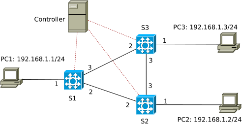

# Idle timeout

The network topology used in this example:



We expand the [ARPcache](../ARPcache) example with idle timeout support.

The previous examples: [simple\_demo](../simple_demo), [simple\_switch](../simple_switch) and [ARPcache](../ARPcache) should be made familiar in order to understand this one.

There are cases in which the controller installs rule specific to a traffic flow, e.g, (source IP, destination IP, TCP source port, TCP destination port) for a temporary communication between two certain end-points, e.g., to download a file. The corresponding rules are used for a short period and then not anymore. These rules occupy some space in the rule table and some resource of the device, hence, causing more overhead in the table look up (when matching a packet) and inefficiency for the device. These one-time used rules should be removed after the communication ends. Removing them manually would be tedious and error-prone. Adding idle timeout feature for them and let them be removed automatically when not used any more is an elegant solution.

## Implementation

To enable idle timeout for rules in a rule table, we need to specify the `support_timeout` feature for that table in the P4 source code:
```
    table dmac {
        key = {
            hdr.ethernet.dstAddr: exact;
        }
        actions = {
            forward;
            send_to_cpu;
            NoAction;
        }
        size = 256;
        support_timeout = true;
        default_action = send_to_cpu;
    }
```

We implemented the support for idle timeout in the `p4utils` library. The timeout notifications sent by a switch to the controller is stored in a queue at the controller:
file `appcore.py`:
```
    self.to_noti = queue.Queue() #timeout notification

    ...

    self.to_noti = self.controller.sniff_timeout_notification()
```
and is processed one by one:
file `arpcache.py`:
```
   for (switch1, queue1) in self.to_noti.items():

   ...

           priority = raw.idle_timeout_notification.table_entry[0].priority
           print(f"delete that entry")
           self.con[switch1].controller.table_delete_match(table_name, normal_match, priority)
```
The `table_delete_match` function is invoked to remove the timeout rule.

When installing a rule in the switch, the controller specifies the timeout value for that rule by:
```
    self.con[swid].controller.table_add("dmac", "forward", [arpp.hwsrc], [str(port)], idle_timeout = TIMEOUT)
```
If a rule is inactive for the TIMEOUT period (e.g., 10s), the switch sends a notification to the controller, the controller then removes that rule as shown in the code snippet above.

We modify the `table_add` function to support timeout, by default `idle_timeout = 0`, and the corresponding rule is not "timed out".

Note that, in this example, only the `dmac` rule table support timeout, the `smac` rule table does not.

## Execution

Compiling the P4 code:
```
p4c-bm2-ss --p4v 16 --p4runtime-files build/packetinout_idletimeout.p4info.txt -o build/packetinout_idletimeout.json packetinout_idletimeout.p4
```

Making switches S1, S2, S3 become P4-switches, the command below applies for switch S1 (see [simple\_demo](../simple_demo) for detailed description of the options): 
```
sudo simple_switch_grpc -i 1@eth1 -i 2@eth2 -i 3@eth3 --pcap pcaps --nanolog ipc:///tmp/s1-log.ipc --device-id 1 build/packetinout_idletimeout.json --log-console --thrift-port 9090 -- --grpc-server-addr 0.0.0.0:50051 --cpu-port 255
```
It is important to specify the CPU-port to be the same port declared in the P4 code (file `packetinout_idletimeout.p4`), being 255 in this case.

Executing the controller program:
```
python arpcache.py
```

Generating traffic between end-points, e.g., using ping:

PC1: `ping 192.168.1.2`

# Checking with `simple_switch_CLI`:

We can use the command `simple_switch_CLI` to check the effect of timeout:

In switch S1:
```
simple_switch_CLI
table_dump dmac
```
The output looks like:
```
Dumping entry 0x0
Match key:
ethernet.dstAddr    : EXACT     00163e000002
Action entry: MyIngress.forward - 01
Life: 522ms since hit, timeout is 10000ms

Dumping entry 0x1
Match key:
ethernet.dstAddr    : EXACT     00163e000006
Action entry: MyIngress.forward - 03
Life: 544ms since hit, timeout is 10000ms
```
The timeout information is not shown for rules in table `smac` when we check its rules using `simple_switch_CLI` in a similar way.

More instructions on using `simple_switch_CLI` are provided in [simple\_demo](../simple_demo).

When we terminate the traffic flow between end-points, the corresponding rules will be automatically removed after a period of TIMEOUT, in this case, after 10s.
