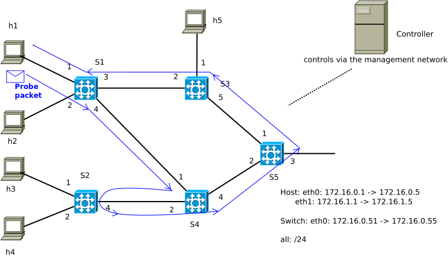

# Network Telemetry

From [RFC9232](https://www.rfc-editor.org/rfc/rfc9232.html):

"Network telemetry is a technology for gaining network insight and facilitating efficient and automated network management. It encompasses various techniques for remote data generation, collection, correlation, and consumption. Network telemetry addresses current network operation issues and enables smooth evolution toward future intent-driven autonomous networks (RFC9232)."

"Autonomic Network is the logical next step for network evolution following Software-Defined Networking (SDN), which aims to reduce (or even eliminate) human labor, make more efficient use of network resources, and provide better services more aligned with customer requirements... The related technique of  Intent-based Networking requires network visibility and telemetry data in order to ensure that the network is behaving as intended."

"While the data processing capability is improved and applications require more data to function better, the networks lag behind in extracting and translating network data into useful and actionable information in efficient ways. The system bottleneck is shifting from data consumption to data supply. Both the number of network nodes and the traffic bandwidth keep increasing at a fast pace. The network configuration and policy change at smaller time slots than before. More subtle events and fine-grained data through all network planes need to be captured and exported in real time. In a nutshell, it is a challenge to get enough high-quality data out of the network in a manner that is efficient, timely, and flexible."

"The use cases essential for network operations that motivate network telemetry cover various dimensions: security, policy and intent compliance, SLA compliance, root cause analysis, network optimization, event tracking and prediction ..."

"For a long time, network operators have relied upon SNMP, Command-Line Interface(CLI), or Syslog to monitor the network. Some other OAM techniques are also used to facilitate network troubleshooting. These conventional techniques are not sufficient to support the above use cases' dimensions for the a number of reasons... Those challenges were addressed by newer standards and techniques (e.g., IPFIX/Netflow,  Packet Sampling (PSAMP), IOAM, and YANG-Push), and more are emerging."

The network topology used in this example:


We attempt to explore the in-band network telemetry in the data plane using P4, which is specified in a dedicated [INT specification](https://p4.org/p4-spec/docs/INT_v2_1.pdf) of the P4.org Working Group, and based on an existing implementation available in the [P4Lang tutorial](https://github.com/p4lang/tutorials/tree/master/exercises/link_monitor) site.

The previous examples: [simple\_demo](../simple_demo), [simple\_switch](../simple_switch) and [ARPcache](../ARPcache) should be made familiar in order to understand this one.


## Implementation

Switches S1, S2, S3, S4, S5 are programmed using P4 so that they can forward normal packets (ARP, IP...) as usual, and add a new header containing statistical data to a packet if that packet is dedicated for probing the network. A probe packet is distinguished from a normal packet based on its own Layer2 ethertype value.

Each switch add the following data to a probe packet
```
header probe_data_t {
    bit<1> bos;
    bit<7> swid;
    bit<8> port;
    bit<32> byte_cnt;
    time_t last_time;
    time_t cur_time;
  }
```
The telemetry sink (end-point) derives the throughput at each switch

`Throughput (Mbps) = 8.0*byte_cnt/(cur_time - last_time)`


## Execution

Follow the instructions in the previous examples ([simple\_demo](../simple_demo), [simple\_switch](../simple_switch)...) to compile the P4 source code and run the P4-switches.

Inside the controller, execute: `python arpcache.py`

Open 2 different windows for host h1. In the first window, run: `sudo python receive.py`. In the second one, run: `sudo python send.py`. The measurement of link utilization is displayed in the first window.
We can generate traffic from e.g., host h5 to other hosts using iperf to test the measurement.

The probe packet traverses the network as shown in the below figure:



Host h1 sends probe packets into the network periodically (e.g., every 1s), each of these probe packets traverses through each switches and collects the statistical information related to link utilization, and finally comes back to the sender (host h1), where it is analysed and the link throughput at each switch is derived.

Host h1 can decide which path a probe packet should take (we assume the topology is known beforehand). In our case, the path of probe packets (sent by host h1) is h1-s1-s3-s5-s4-s2-s4-s1-h1. Host h1 can then measure the link utilization (throughput) of all links in the path.

The collection of data in a probe packet is made possible thanks to the capability of the P4 switches in composing and adding new headers into a packet. More generally, the capability of network programming  (instead of only configuring) enables this way of network telemetry in the data plane, in addition to the traditional methods with e.g., ping, traceroute...

## Result

iperf from host h5 to host h4, then we can observe this at host h1:

```
Switch 1 - Port 1: 0.0010372295598456522 Mbps
Switch 3 - Port 2: 1.0750136940924333 Mbps
Switch 5 - Port 1: 0.0007506368434922182 Mbps
Switch 4 - Port 4: 0.0006069215004936228 Mbps
Switch 2 - Port 4: 0.0004629971481770485 Mbps
Switch 4 - Port 2: 1.0864437961680748 Mbps
Switch 1 - Port 4: 1.0849870805925887 Mbps
```

## What can be monitored

+ Ingress interface identifier
+ Ingress timestamp
+ Egress interface identifier
+ Egress timestamp
+ Hop latency
+ Egress interface TX link utilization
+ Queue occupancy
+ Buffer occupancy

## Conclusions and prospects

+ Network telemetry: acquires and utilizes network data remotely for network monitoring and operation. Network telemetry addresses current network operation issues and enables smooth evolution toward future intent-driven autonomous networks ([RFC9232](https://www.rfc-editor.org/rfc/rfc9232.html))
+ Autonomic Networking ([RFC7575](https://www.rfc-editor.org/rfc/rfc7575.html)) with the capabilities of self-management, self-configuration, self-optimization, self-healing, self-protection
+ Intent-based Networking ([RFC9315](https://www.rfc-editor.org/rfc/rfc9315.html))
