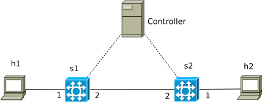

# A simple demo of P4-based SDN

We demonstrate SDN via a simple example, showing how a controller can install rules in two switches to allow traffic between two end-points. We provide a brief introduction of SDN in [explaining SDN](../explaining_SDN).

The network topology used in this example is shown below. The dashed links between Controller and switches represent the management network, the solid links are for the actual connections in the data plane. Note that the controller can only control the P4-switches (s1 and s2), not the hosts (h1, h2). The numbers around a switch indicate its port number (port 1, port 2...).



We assume using a network infrastructure based on virtual machines (VM). Each host, switch or controller is a VM. We can make a VM become a switch or a controller by executing corresponding programs in that VM, which will be illustrated below. Such a network infrastructure can be constructed by following the instruction in [Infrastructure-as-Code](../Infrastructure-as-Code).

## Execution

We need to compile the P4 program (\*.p4) to obtain the P4 device config (\*.json) and the P4Info file (\*.p4info.txt), which are to be consumed by P4 switches and controllers, respectively. 

### Compiling the P4 program:

```
p4c-bm2-ss --p4v 16 --p4runtime-files build/simple_demo.p4info.txt -o build/simple_demo.json simple_demo.p4
```

### Deploying P4 switches:
After copying the config file `simple_demo.json` to switches s1 and s2, we can make switch s1 become a P4 switch by the following commands:

```
simple_switch_grpc -i 1@eth1 -i 2@eth2 --pcap pcaps
--nanolog ipc:///log.ipc --device-id 1 simple_demo.json
--log-console --thrift-port 9090
-- --grpc-server-addr 0.0.0.0:50051 --cpu-port 255
```

The command simple\_switch\_grpc creates a SimpleSwitchGRPC target, which is a version of SimpleSwitch with P4Runtime support (see [simple\_switch\_grpc](https://github.com/p4lang/behavioral-model/blob/main/targets/simple_switch_grpc/README.md) for more details).

+ the part `-i 1@eth1 -i 2@eth2` specifies the binding of the switch ports to
the “physical” interfaces of the (virtual) machine,
+ `--pcap pcaps`: generating pcap files for interfaces,
+ `--nanolog ipc:///log.ipc`: IPC socket to use for nanomsg pub/sub logs,
+ `--device-id 1`: device ID, used to identify the device in IPC messages,
+ `--log-console`: enabling logging on stdout,
+ `--thrift-port 9090`: TCP port on which to run the Thrift runtime server,
+ `--grpc-server-addr 0.0.0.0:50051`: bind gRPC server to the given address,
+ `--cpu-port 255`: the logical port where a switch can send a packet to a controller (packet-in), or a controller can send a packet to a switch (packet-out).

For more information, we can use the command `simple_switch_grpc --help`.

Similarly, we can create a P4 switch at switch s2:

```
simple_switch_grpc -i 1@eth1 -i 2@eth2 --pcap pcaps
--nanolog ipc:///log.ipc --device-id 2 simple_demo.json
--log-console --thrift-port 9090
-- --grpc-server-addr 0.0.0.0:50051 --cpu-port 255
```

Be sure that the corresponding interfaces of switches s1 and s2 are up before carrying out the above commands. E.g., the interface `eth1` can be brought up by the command:
```
ip link set eth1 up
```


### Executing the control application

Execute the controller program in the controller machine:
```
python controller.py
```


### Configuring IP addresses for end-points

The explanation in this paragraph is just relevant if the network infrastructure is constructed based on virtual machines as described in [Infrastructure-as-Code](../Infrastructure-as-Code#4-explaining-the-implementation-of-vm-based-test-bed). In this case, each host has two interfaces `eth0` and `eth1`. The first interface `eth0` is connected to the management network. The second interface `eth1` is dedicated for the "production" network. Testing traffic is sent and received on this interface. We can configure the `eth1` interface of host h1 as follows:
```
ip addr add 192.168.1.1/24 broadcast 192.168.1.255 dev eth1
ip link set eth1 up
```
Likewise, for host h2:
```
ip addr add 192.168.1.2/24 broadcast 192.168.1.255 dev eth1
ip link set eth1 up
```


### Testing

We can test the communication between the hosts h1 (IP: 192.168.1.1) and h2 (IP: 192.168.1.2) via the `ping` command. From host h1, do:

```
ping 192.168.1.2
```

The ping should be successful.


## Explanation

In the P4 program, we specify a table, naming `table_forwarding`.

```
    table table_forwarding {
        key = {
            standard_metadata.ingress_port: exact;
        }
        actions = {
            forward;
            NoAction;
        }
        size = 2;
        default_action = NoAction;
    }
```

This table has the key (match) as the `ingress port` of the incoming packet, and the actions being either `forward` or `NoAction` (do nothing), the `forward` action has the parameter `egress port`. Its size is 2, meaning that the table can host at most 2 rules, each rule has the match fields specified in `key`, and action defined in `actions`. If not specified, the default table size is 1024. The given table size informs the hardware (if a hardware P4 switch is used) to prepare the resource for the table.

Once deploying this P4 program in the P4 switch, the switch has a table with the rule structure that can match packets based on these defined key and actions. Note that the switch has such a table, but there is no rule in that table, except for the default rule (do nothing: `default_action = NoAction`). At this point, the two hosts h1 and h2 cannot ping each other.

Multiple tables can be defined, but only those used in the `apply` block will be effective:

```
    apply {
        table_forwarding.apply();
    }
```

Check [P4 cheat sheet](https://github.com/p4lang/tutorials/blob/master/p4-cheat-sheet.pdf) for a brief overview of what P4 can do.

When executing the controller, it installs two rules in each switch via the `table_add` command (see [SimpleSwitchP4RuntimeAPI](https://nsg-ethz.github.io/p4-utils/p4utils.utils.sswitch_p4runtime_API.html#p4utils.utils.sswitch_p4runtime_API.SimpleSwitchP4RuntimeAPI.table_add)). The rules enforced in switch s1 say: if `ingress port` port of a packet is 1, send it out of port 2 (`egress port` = 2), and if `ingress port` is 2, `egress port` is 1. It is similar for the rules in switch s2.

```
# add rules in switch s1
con[1].table_add('table_forwarding', 'forward', ['1'], ['2'])
con[1].table_add('table_forwarding', 'forward', ['2'], ['1'])

# add rules in switch s2
con[2].table_add('table_forwarding', 'forward', ['1'], ['2'])
con[2].table_add('table_forwarding', 'forward', ['2'], ['1'])
```

Now there are rules in the switches s1 and s2, which can handle traffic between the hosts h1 and h2.

## Using `simple_switch_CLI` for data plane debugging

The command `simple_switch_CLI` is useful for debugging purpose in the data plane. For example, while switch S1 is running, we can open another terminal window to observe or manipulate its rule tables as follows:

```
ssh root@s1
simple_switch_CLI
show_tables #show the existing tables in this switch
table_dump table_forwarding #show the contents of the rule table named table_forwarding
table_add table_forwarding forward 1 => 2 # add to table table_forwarding a rule, 
                 # match key = 1, action = forward, action parameter = 1
```

More commands and their details are described at the p4language GitHub [link](https://github.com/p4lang/behavioral-model/blob/main/docs/runtime_CLI.md).

