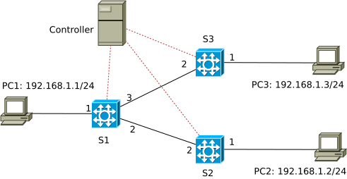

# Implementing simple l2-learning switch with P4

This imitates the behaviour of a normal traditional switch: upon receiving a packet, the switch looks at its destination MAC address, if there is no matching rule in its switching table, the switch floods that packet on all ports except for the incoming port. The switch also notes the source address, say `MAC-addr`, the incoming port, say `P`, and adds a corresponding rule to its switching table: if the destination MAC address of a packet is `MAC-addr`, then send it out of port `P`.

The switch does not work properly in a network topology containing loops. To tackle this, we implement another P4 program and controller application, namely [ARPcache](../ARPcache), that can function in that case.

This implementation is based on the L2\_Learning's implementation from nsg-ethz networking group (https://github.com/nsg-ethz/p4-learning/tree/master/exercises/04-L2_Learning/p4runtime)

The explanation to controller functions can be found at: https://nsg-ethz.github.io/p4-utils/p4utils.utils.sswitch_p4runtime_API.html

The digest method is explained at https://p4.org/p4-spec/p4runtime/main/P4Runtime-Spec.html#sec-digest

The network topology used in this example:



Consider the `apply` block of the P4 program:

```
    apply {

        smac.apply();
        if (dmac.apply().hit){
            //
        }
        else {
            broadcast.apply();
        }
    }
```

First, the `smac` table is used to match incoming packets, then `dmac` is checked, if a packet is not matched by any rule in the `dmac` table, the `broadcast` table will be applied on it.

The `smac` table:
```
    table smac {

        key = {
            hdr.ethernet.srcAddr: exact;
        }

        actions = {
            mac_learn;
            NoAction;
        }
        size = 256;
        default_action = mac_learn;
    }
```
has a match field being the source Ethernet address (MAC address), and the two actions: `mac_learn` or `NoAction`. The `mac_learn` action:
```
    action mac_learn(){
        meta.learn.srcAddr = hdr.ethernet.srcAddr;
        meta.learn.ingress_port = standard_metadata.ingress_port;
        digest<learn_t>(1, meta.learn);
    }
```
records the MAC address of an incoming packet and its `ingress_port` (the port via which the packet comes into the switch) in the `meta.learn` variable. The default action of this table is `mac_learn`, which sends a "digest" of the packet including the MAC address and the `ingress_port` to the controller. For a new packet entering the P4-switch, this default action is applied as there is no rule in the `smac` table matching it. There is also no matching rule in `dmac` table (in other words, there is no `hit` for that packet in this table), hence the `broadcast` table is applied, which will send the packet on all ports, except for the incoming port. This behavior of the `broadcast` table is defined by the controller (file `l2_learning_controller.py` via the code snippet:
```
    def add_boadcast_groups(self):
        for i,sw in enumerate(switches, start=1):
            interfaces_to_port = self.topo.get_node_intfs(fields=['port'])[sw].copy()
            mc_grp_id = 1
            for ingress_port in interfaces_to_port.values():
                port_list = list(interfaces_to_port.values())
                del(port_list[port_list.index(ingress_port)])
                # Add multicast group and ports
                self.con[i].controller.mc_mgrp_create(mc_grp_id, port_list)
                # Fill broadcast table
                self.con[i].controller.table_add("broadcast", "set_mcast_grp", [str(ingress_port)], [str(mc_grp_id)])
                mc_grp_id +=1
```

Once receiving a digest of a new packet (containing a source MAC address and an incoming port of that packet in a switch) sent by the default rule of the `smac` table of a switch, the controller knows that that MAC address is reachable via that port of that switch, the controller installs the corresponding rules in the `smac` and `dmac` tables:
```
        self.con[sw].controller.table_add("smac", "NoAction", [str(mac_addr)])
        self.con[sw].controller.table_add("dmac", "forward", [str(mac_addr)], [str(ingress_port)])
```
That is how the controller "learns" the MAC addresses of the end-points in the network. Gradually, it learns all MAC addresses and installs all necessary rules in the `smac` and `dmac` table. When a packet then arrives at a switch, the matching rule in the `smac` table does nothing (`NoAction`), the `dmac` table is `hit` by an existing rule and forwards the packet accordingly, thus the `broadcast` table will not be invoked.
