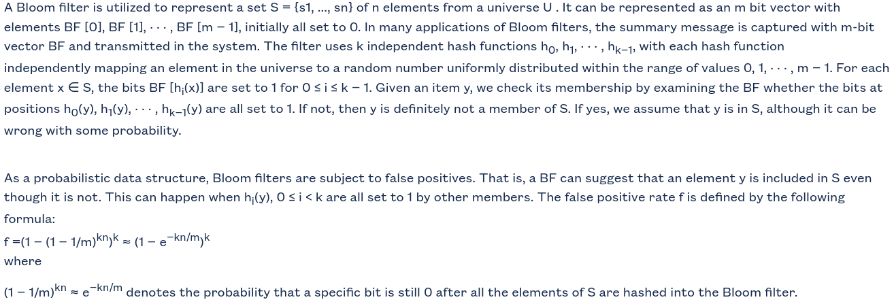

# Statefulness in P4-Switch

Statefulness from source A to destination B is understood as: A can initiate the communication to B, but B cannot. B can only answer or communicate with A once A has started that communication.

It is easier to handle statefulness in the controller, however, the rate of packet loss in the data plane can be high when the switch is waiting for instructions from the controller.

We want to tackle this problem by sharing the tasks more appropriately between the controller and the switch. Note that P4-switch is not a normal switch, it can be programmable by the P4-language, the control plane can be separated from the data plane, i.e., the data plane resides in the switch while the controller plane can either locate at the same place (as in a normal switch) or at a remote server.

The idea is to use the Bloom filter (see the paper [A Stateful Bloom Filter for Per-Flow State Monitoring](https://ieeexplore.ieee.org/document/9349161)) in the data plane to first handle statefulness immediately (but temporarily) and to avoid packet loss, in the meantime, the controller is notified and will react with proper rule installation, and reset the respective bits of  the Bloom filter corresponding to the temporary statefulness handling. This reduces the False Positive rate of the Bloom filter in handling subsequent traffic flows.

All in all, the proposed solution helps reduce packet loss, improve performance in statefulness handling and reduce the false positive rate of the Bloom filter.

## Bloom filter

This explanation of the Bloom Filter is cited from this paper: K. Xie et al., "A Stateful Bloom Filter for Per-Flow State Monitoring," in IEEE Transactions on Network Science and Engineering, vol. 8, no. 2, pp. 1399-1413, 1 April-June 2021, doi: 10.1109/TNSE.2021.3057459.

In simple words, when the Bloom Filter says that an element does not belong to a set, it is absolutely correct. However, if it says that the element belongs to that set (positive), there is some probability that it is wrong (false), i.e., the element does not belong to the set, thus the term false positive.

## Design

Assume that we want the P4-switch to ensure the stateful connection from host A to host B. A can initiate the communication but B cannot.

The implementation idea is as follows.

+ When the switch receives a packet from one of its ports, it checks the direction of the packet. This can be done based on the ingress port or the source IP address of the packet. The P4 switch matches the packet against its forwarding table (based on IP src, IP dst, IP protocol, L4 src, L4 dst) (IP protocol can be 6 for TCP, or 17 for UDP, can also be 1 for ICMP). If matched, the packet is forwarded according to the matching rule. Otherwise:
    + If the packet is from A (as said above, this can be checked based on the ingress port or the IP address of the packet), since we allow this direction, the tuple (IP src, IP dst, IP protocol, L4 src, L4 dst) is extracted from the packet and hashed (using the existing hash functions of the P4-switch), and the corresponding bits int the bloom filter is set (to 1). Then the packet is allowed to be sent further. In the same time, the P4-switch will digest (or send the necessary information extracted from the packet, instead of sending the whole packet which might be heavy and contain to much redundant information) this tuple together with the position of the set cells in the bloom filter to the controller.
    + If the packet is from B, it is checked by the bloom filter to see if there is an existing connection from A to B. This is done by extracting the tuple (IP dst, IP src, IP protocol, L4 dst, L4 src) of the packet, apply the hash functions and check the resulting bits in the bloom filter, if all corresponding bits are set, the packet is considered to be an answer (i.e., A has initiated the connection to B before), and is allowed. Otherwise, it is dropped.

+ The controller: upon receiving the digest message (the controller has a thread always listening for digest message) from the switch, the controller parses it, extract the tuple (IP src, IP dst, IP protocol, L4 src, L4 dst), and the positions of the bit in the bloom filter. Then, the controller installs 2 rules in the switch, one for the forwarding direction from A to B, and one for the reverse direction from B to A, these rules has the idle timeout of 10s, i.e., if there is no packet matched by them for 10s, they becomes idle and will be removed, this strategy helps reduce the size of the rule table in the switch, which boosts the matching performance thanks to the better searching for the match entry against an incoming packet. At the same time, the controller sends a special packet-out message to the switch to tell it to reset the corresponding bits to 0 in the bloom filter. The switch has a special table taking care of this, e.g., a table that is active for packet-out message from the controller.

+ Once receiving the packet-out message from the controller, the switch resets the mentioned bits in the bloom filter. As the switch already has rules installed by the controller, further packets that would be handled by the bloom filter will now be handled by these rules (this table has higher priority than the bloom filter table). By resetting the bits of the bloom filter,  the probability of false positive in determining if a given element belongs to a set is reduced. This is because the less bit is set in the bloom filter, the less likelihood an element that is actually not belong to the set would be wrongly determined by the bloom filter that it does.

**To be examined:** how many hash algorithms can a P4 switch support? 8 are listed at https://github.com/p4lang/p4c/blob/main/p4include/v1model.p4#L394 including crc32, crc32_custom, crc16, crc16_custom,  random, identity, csum16, xor16. If the crc32_custom and crc16_custom can be customised into multiple hash functions, we can have a rich set of candidate hash functions to use in the bloom filter.

## Implementation

Based on this existing example (purely handling statefulness in data plane using the Bloom Filter): https://github.com/nsg-ethz/p4-learning/tree/master/examples/stateful_firewall

We have integrated the above code in our small testbed (state is purely handled in the data plane). The controller code is based on that of the [Intent-based Networking](../Intent-based-Networking).

**TODO**: publish the code

## Result

Early results (without controller's intervention, i.e., handling statefulness purely in the data plane): on a simple network containing host h1 connected to port 1 of switch s1, then port 2 of switch s1 is connected to host h2:

h1 – s1 – h2

when we perform the iperf command from h1 (IP: 172.16.1.1/24) to h2 (IP:172.16.1.2/24):

h1: iperf -c 172.16.1.2 -u

h2: iperf -s -u

The reported packet loss is 0.

When we do the same with state-handling in the control plane, the packet loss is usually greater than  5 (5 to 10 losts packets). Worse, if the controller is busy, the packet loss is much higher, even up to 100%. So the offloading of state-handling in the data plane is much helpful.

TODO: implement and evaluate the part regarding controller's intervention as proposed above. 
